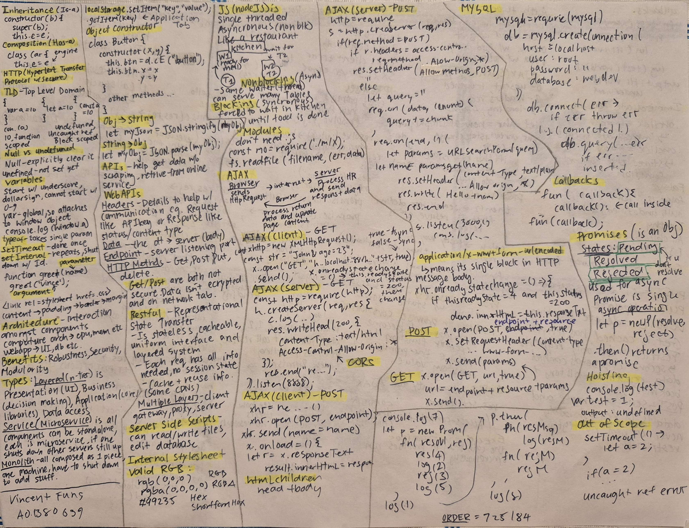

This is **live-rendered** using Python and Flask.
### Vincent Fung A01380639

---

# Weeks 1 - 9
## Topics Covered:

### Section 1:
- Inheritance
- Composition
- Definitions
    - HTTP
    - TLD
- Block Scoped Functions
- Null vs undefined
- Variables
- SetTimeout vs SetInterval
- Architecture
- Benefits
- Types of Architecture

### Section 2:
- LocalStorage
- Object Constructor
- Converting Objects -> String
- APIs
- WebAPIs
- Server Side Scripts
- Internal StyleSheets

### Section 3:
- NodeJS
- NonBlocking / Blocking
- Modules
- AJAX (Client/Server)

### Section 4:
- MySQL
- Callbacks
- Promises
- Hoising / Out-of-scope

### Section 5:
- Callbacks
- Immediate Calling
- Falsy / Truthy
- Promises, Executor + Resolving
- CORS
- HTTP Response Codes

### Section 6:
- http.server Routing, queries, and pathing
- Method Resolutions
- Micro / Macro Tasks

---

# Front (Sections 1-3)

# Back (Sections 4-6)
